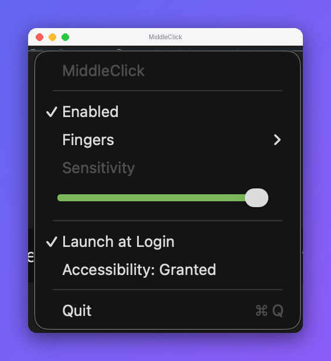

# MiddleClick

A tiny macOS menu-bar app that turns a three-finger tap on the trackpad into a real middle click — so you can open links in a new tab, close tabs, and everything else middle-click does, without a middle mouse button.



## Download

**[⬇︎ Download for macOS](https://github.com/Alyetama/middleClick/releases/latest/download/MiddleClick.dmg)**

`https://github.com/Alyetama/middleClick/releases/latest/download/MiddleClick.dmg` always points at the newest release, because the DMG filename carries no version — see [Releases](https://github.com/Alyetama/middleClick/releases) for the changelog.

## Features

- Detects a real tap (quick touch + release, no swipe, no long rest) via Apple's private `MultitouchSupport` framework and synthesizes a genuine center-button click event.
- Configurable finger count (2, 3, or 4) and a sensitivity slider to tune tap timing/movement tolerance.
- Menu-bar only — no Dock icon, no windows.
- Optional Launch at Login (via `SMAppService`).

## First launch (opening an unsigned app)

**MiddleClick isn't signed with an Apple Developer ID**, so macOS blocks it the
first time you open it. This is expected — you only need to do one of the
following once, and it opens normally afterward.

**1. Right-click to open.** In Finder, **Control-click** (or right-click)
`MiddleClick`, choose **Open**, then click **Open** again in the dialog.

**2. If macOS still won't let you (newer versions):** open
**System Settings → Privacy & Security**, scroll down to the message about
`MiddleClick` being blocked, and click **Open Anyway**. Confirm with
**Open Anyway** (and Touch ID or your password if asked).

**3. Terminal fallback.** If neither works, remove the quarantine flag and open
it normally:

```bash
/usr/bin/xattr -dr com.apple.quarantine /Applications/MiddleClick.app
```

(Adjust the path if you keep the app somewhere other than `/Applications`.)

After first launch, grant **Accessibility** access when prompted (System Settings → Privacy & Security → Accessibility) — it's required to post the synthetic click event.

## Build from source

```bash
git clone https://github.com/Alyetama/middleClick.git
cd middleClick
./build_app.sh
```

## License

[MIT](LICENSE) © 2026 Alyetama
