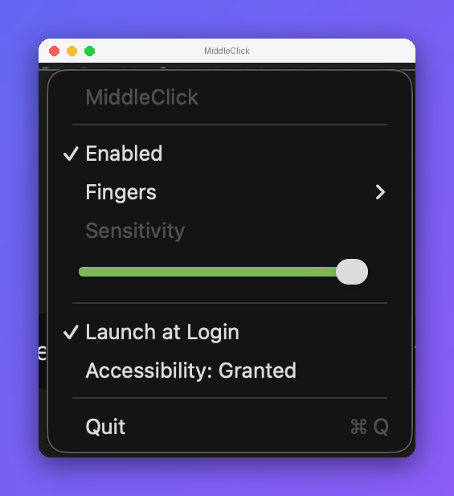

# MiddleClick

A tiny macOS menu-bar app that turns a three-finger tap on the trackpad into a real middle click — so you can open links in a new tab, close tabs, and everything else middle-click does, without a middle mouse button.



## Download

**[⬇︎ Download for macOS](https://github.com/Alyetama/middleClick/releases/latest/download/MiddleClick.dmg)**

`https://github.com/Alyetama/middleClick/releases/latest/download/MiddleClick.dmg` always points at the newest release, because the DMG filename carries no version — see [Releases](https://github.com/Alyetama/middleClick/releases) for the changelog.

## Features

- Detects a tap (fingers touch and lift without swiping or resting) via Apple's private `MultitouchSupport` framework and synthesizes a genuine center-button click event.
- Configurable finger count (2, 3, or 4) and a sensitivity slider that widens both the tap window (0.30 s at the low end to 1.20 s at the high end) and the movement tolerance before a tap counts as a swipe.
- Menu-bar only — no Dock icon, no windows.
- Optional Launch at Login (via `SMAppService`).

At a 3- or 4-finger setting, one extra contact is tolerated, so a thumb or palm grazing the trackpad still registers. A 2-finger setting requires exactly two.

## Requirements

macOS 13 or newer, Apple Silicon or Intel. The released app is a universal binary — `lipo -archs` reports `x86_64 arm64`, and both slices link `MultitouchSupport`. Developed and tested on macOS 26.5.1 (M5 Pro); the `x86_64` slice builds and links but has not been run on Intel hardware.

## First launch (opening an unsigned app)

**MiddleClick isn't signed with an Apple Developer ID**, so macOS blocks it the
first time you open it. This is expected — you only need to do one of the
following once, and it opens normally afterward.

**1. Right-click to open.** In Finder, **Control-click** (or right-click)
`MiddleClick`, choose **Open**, then click **Open** again in the dialog.

**2. If macOS still won't let you (newer versions):** open
**System Settings → Privacy & Security**, scroll down to the message about
`MiddleClick` being blocked, and click **Open Anyway**. Confirm with
**Open Anyway** (and Touch ID or your password if asked).

**3. Terminal fallback.** If neither works, remove the quarantine flag and open
it normally:

```bash
/usr/bin/xattr -dr com.apple.quarantine /Applications/MiddleClick.app
```

(Adjust the path if you keep the app somewhere other than `/Applications`.)

After first launch, grant **Accessibility** access when prompted (System Settings → Privacy & Security → Accessibility) — it's required to post the synthetic click event.

## Build from source

```bash
git clone https://github.com/Alyetama/middleClick.git
cd middleClick
./build_app.sh
```

Produces `MiddleClick.app` in the project root, ad-hoc signed. Move it to `/Applications`.

## Limitations

- **Untested on Intel.** The binary is universal and the `x86_64` slice links correctly, but it has only been run on Apple Silicon.
- **Ad-hoc signed, not notarized.** Every rebuild changes the signature, so macOS drops the Accessibility grant; remove and re-add the app after upgrading.
- **Built on a private framework.** `MultitouchSupport` is not public API. It has been stable for years and is what other trackpad utilities use, but Apple can change or remove it in any macOS release.
- **Trackpad only.** The gesture path reads multitouch devices; it does not remap buttons on a mouse that already has a physical middle button.
- **Overlaps with system gestures.** A three-finger setting shares hardware with macOS three-finger swipes; the movement check is what separates a tap from a swipe, so a sloppy swipe can still register as a tap at high sensitivity. Lower the slider or switch to four fingers if that happens.
- **Not verified end to end in an automated test.** A real trackpad tap cannot be synthesized programmatically, so detection and click emission were each verified in code and by build, but the full gesture-to-click path is confirmed only by using it. To watch it decide in real time:

```bash
osascript -e 'quit app "MiddleClick"'
MIDDLECLICK_DEBUG=1 /Applications/MiddleClick.app/Contents/MacOS/MiddleClick
```

Each gesture logs one line in this format (from the `NSLog` call in `GestureDetector.swift`), ending in `FIRE` when a middle click is posted or `skip` when the gesture was rejected:

```
MiddleClick tap: max=%d needed=%d elapsed=%.3fs moved=%@ -> %@
```

## License

[MIT](LICENSE) © 2026 Alyetama
